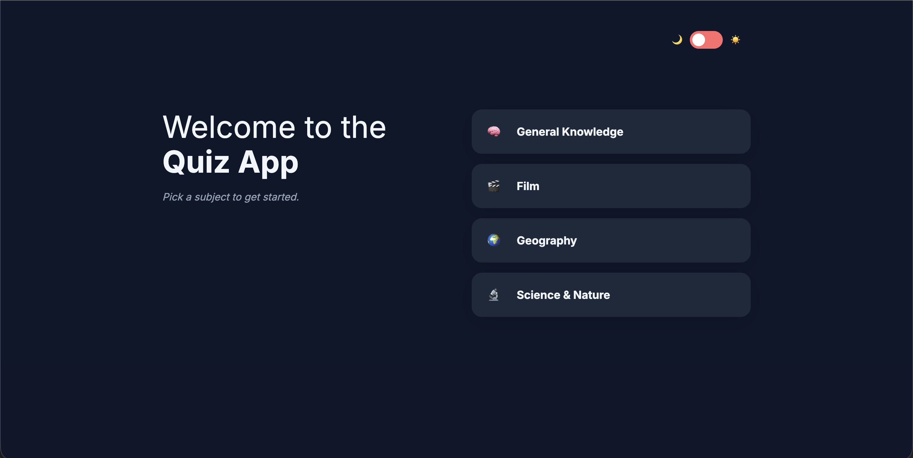

# Quiz App

An interactive trivia quiz application built with vanilla JavaScript. Users can customize their quiz by selecting a category, difficulty level, and number of questions before testing their knowledge through timed questions.

The project focuses on clean JavaScript architecture, modular code organization, API integration, state management, and building an engaging user experience without relying on a frontend framework.

## Live Demo

[Live URL](silly-quokka-1ce4d3.netlify.app)

## Screenshot



## Features

- Select from multiple quiz categories
- Choose quiz difficulty level
- Select number of questions
- Fetch questions dynamically from an external API
- Randomize answer choices
- Countdown timer for each question
- Answer validation with correct/incorrect feedback
- Progress tracking during the quiz
- Score calculation
- High score tracking using local storage
- Light and dark theme toggle
- Responsive design for desktop and mobile devices

## Built With

- HTML5
- CSS3
- JavaScript (ES6 Modules)
- Open Trivia Database API
- Local Storage API

## Project Structure

quiz-app/
│
├── assets/
│ ├── images/
│ │ └── quiz-app.png
│ │
│ └── fonts/
│ └── inter-v20-latin/
│ ├── inter-v20-latin-600.woff2
│ ├── inter-v20-latin-700.woff2
│ └── inter-v20-latin-regular.woff2
│
├── modules/
│ ├── api.js
│ ├── quiz.js
│ ├── state.js
│ ├── storage.js
│ ├── theme.js
│ ├── timer.js
│ └── ui.js
│
├── utils/
│ └── decode.js
│
├── index.html
├── main.js
├── styles.css
└── README.md

## How It Works

1. Users start by selecting a quiz category.
2. Users choose their preferred difficulty level.
3. Users select the number of questions they want to answer.
4. The application builds a request using the selected quiz configuration.
5. Questions are fetched from the trivia API.
6. Questions and answers are dynamically rendered.
7. Users answer questions before the timer expires.
8. The application calculates the final score and stores high scores locally.

## Architecture

This project uses JavaScript ES modules to separate application responsibilities and keep the code maintainable.

### Application State

The `state.js` module manages shared application data:

- Selected category
- Selected difficulty
- Number of questions
- Current question
- Score tracking

Keeping state separate allows different parts of the application to access shared data without tightly coupling modules together.

### API Layer

The `api.js` module handles all communication with the external trivia API.

Responsibilities include:

- Building API requests
- Fetching quiz questions
- Handling API errors

Keeping API logic separate prevents network-related code from being mixed with UI logic.

### Quiz Logic

The `quiz.js` module manages the core quiz functionality:

- Rendering questions
- Displaying answer choices
- Handling answer selection
- Validating answers
- Updating scores
- Moving between questions
- Showing results

### UI Management

The `ui.js` module handles DOM-related functionality.

Examples:

- Resetting quiz screens
- Clearing previous selections
- Managing UI states between quiz attempts

Separating UI updates from application state helps prevent stale UI when restarting the quiz.

### Data Persistence

The `storage.js` module manages high scores using the browser's Local Storage API.

This allows users to keep their scores saved between sessions without requiring a backend.

## Challenges & Solutions

### Keeping UI State and Application State Synchronized

One challenge was resetting the application after completing a quiz.

Initially, resetting the stored quiz data did not automatically update the visible interface. Previous selections could remain displayed because the DOM maintained its previous state.

The solution was separating state resets from UI resets:

- `state.js` clears application data
- `ui.js` clears visual elements and resets screens

This keeps responsibilities separated and makes the application easier to maintain.

### Creating a Modular Vanilla JavaScript Application

Without a framework handling components and state automatically, organizing the application required careful separation of responsibilities.

The project was structured into dedicated modules for:

- API communication
- Quiz behavior
- State management
- Storage
- Theme handling
- UI updates

This approach improves readability and makes future features easier to add.

## Future Improvements

Potential improvements include:

- Add user accounts and cloud-based score tracking
- Add more quiz customization options
- Add automated testing
- Add TypeScript migration

## Getting Started

### Clone the Repository

```bash
git clone your-repository-url
```
